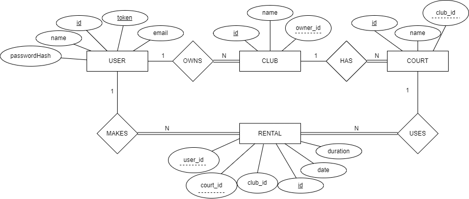
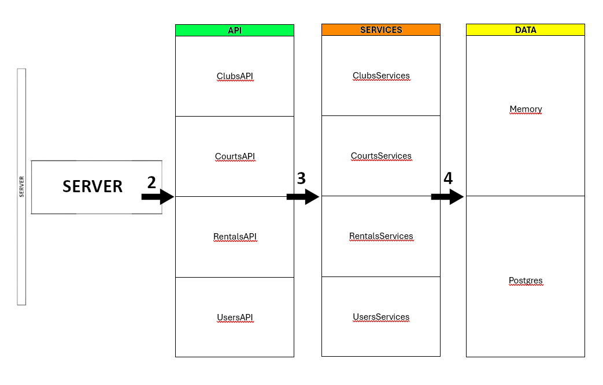

## leic44d-g12
### Authors:

- 42146 - António Pimentel
- 51838 - Martim Felgas

---

# Padel-API - https://service-ls-2425-2-44-g12.onrender.com/

### Introduction

The Padel API enables the creation and management of users, clubs, courts, and rentals through a RESTful backend. A Single Page Application (SPA) provides a web-based interface to access these operations, and the full system is deployed on Render using Docker and PostgreSQL.

---

## Website Video

* [Padel-API](https://youtu.be/Ore6eVdCFA4)

---

## Modeling the database

### Conceptual model

The following diagram holds the Entity-Relationship model for the information managed by the system.

We highlight the following aspects:
- The relationship between **users** and **clubs** is one-to-many. A user can own multiple clubs, but a club has a single owner.
- **Courts** belong to **clubs**, in a one-to-many relationship.
- **Rentals** represent a scheduled usage of a court by a user and are associated with a specific court and club.
- **User email** and **token** must be unique.
- **Court rental** dates are validated to ensure they are in the future and within court availability.

The conceptual model has the following restrictions:
- Email and token of a user must be unique.
- A court must belong to an existing club.
- A rental must refer to an existing user, court, and club.
- Rental dates must be in the future and not overlap with existing rentals for the same court.

---

### Physical Model

The physical model of the database is available in [src/main/sql/createSchema.sql](src/main/sql/createSchema_courts.sql).

We highlight the following aspects of this model:
- All foreign keys are properly defined to ensure referential integrity:
	- ``owner_id`` in ``clubs`` references ``users(id)``
	- ``club_id`` in ``courts`` references ``clubs(id)``
	- ``user_id`` and ``court_id`` in ``rentals`` reference their respective entities
- All **primary keys** are ``SERIAL``, providing auto-incremented integer identifiers.
- The ``users`` table includes:
	- ``email`` with a ``UNIQUE`` and ``CHECK`` constraint to enforce correct format.
	- ``token``, a ``UUID``, used for authenticated access, also unique.
	- ``password_hash``, a ``TEXT`` field storing the securely hashed user password

- The ``rentals`` table uses **timestamp** fields to schedule court usage precisely, and enforces a ``CHECK (duration > 0)`` constraint to ensure valid rental durations.
- **Cascading behavior** is defined on all foreign key relations, both on ``DELETE`` and ``UPDATE``, to ensure consistency when entities are modified or removed.
- All sequences for primary keys (``users_id_seq``, ``clubs_id_seq``, etc.) are explicitly reset to start at 1 to ensure predictable auto-increment behavior, particularly useful during testing or development resets.

---

## Software organization

### Open-API Specification

[OpenAPI Specification YAML](docs/padel-API.yaml)

Our OpenAPI definition documents the full capabilities of the REST API across the entire project. It conforms to version ``3.0.4`` of the OpenAPI specification and provides a comprehensive and structured definition of the endpoints available to clients.

We highlight the following aspects:

- **Entities and operations**: All core entities (``users``, ``clubs``, ``courts``, ``rentals``) are fully described, including CRUD operations and search/filtering capabilities.
- Authentication:
	- Authenticated endpoints are secured via ``bearerAuth``, following a token-based model.
	- Users can sign up with name, email, and password, and later authenticate via a dedicated ``/users/login`` endpoint.

- **Request and response bodies**: Defined clearly through JSON schemas under ``components.schemas``, enabling client-side validation and autocompletion when integrated with frontend tools.
- **Pagination and filtering**: Multiple endpoints support ``limit``, ``offset``, and filter parameters to allow flexible queries, especially in ``/users``, ``/clubs``, and ``/users/{userId}/rentals``.
- **Error handling**: Each route declares expected error codes (``400``, ``401``, ``403``, ``404``, ``409``, ``500``) along with appropriate descriptions, to guide consumers on how to handle API failures gracefully.
- **Date/time handling**: All rental times are ISO 8601 ``date-time`` formatted, ensuring interoperability and correct timezone interpretation.
- **Availability checking**: A dedicated endpoint ``/clubs/{clubId}/courts/{courtId}/available-hours`` provides a way to query which time slots are available for renting.
- **Standard structure and extensibility**: Following OpenAPI standards ensures the backend is easy to test, document and integrate with tools like Swagger UI, Postman, or code generators for frontend clients.

---

### Request Details

To help visualize our implementation of the request schemes we created the following diagram:

All requests follow this flow:

**HTTP Request → API → Services → Storage**

- The `AppServer` routes the request to the correct API class.
- The `API` extracts path/query/body parameters and passes them to `Services`.
- `Services` handles business logic and validations (e.g., duplicate names, availability checks).
- The `Storage` layer talks to either `DataMem` (in-memory) or `DataPostgres` (PostgreSQL).

Example:

A `POST /clubs` request is handled by:
- `ClubsAPI.postClub`
- → `ClubsServices.createClub`
- → `ClubStorage.createClub` (either `ClubsMem` or `ClubsPostgres`)

---

## API Layer

The API layer is responsible for translating HTTP requests into service-level operations, and preparing HTTP responses. It is organized in a modular and testable structure with the following characteristics:

### Structure
- Each entity (Users, Clubs, Courts, Rentals) has its own dedicated API class: ``UsersAPI``, ``ClubsAPI``, etc.

- A central ``API`` class acts as the access point and wiring hub, injecting the correct service dependencies into each API module.

- Routing is handled separately in ``routersAPI``, where each API class is bound to its corresponding HTTP routes using HTTP4K’s ``routes {}`` and ``bind`` DSL.

- DTOs (``dtosAPI``) are used to define the shape of the request and response bodies, and all serialization is done using ``kotlinx.serialization``.

### Request Handling

- The ``AppServer.kt`` initializes the server and binds all routers to their respective API modules.

- Each API method:

  - Extracts path/query/body parameters.

  - Optionally extracts the authentication token using a shared helper ``requireToken()`` (defined in ``APIModel``), ensuring uniform error handling for missing or invalid tokens.

  - Passes validated input to the Services layer.

  - Returns a typed JSON response using a custom helper ``Response.json(body)`` to ensure consistency of ``Content-Type``.

### Security

- All protected endpoints (such as creating clubs or rentals) are wrapped with an authentication ``Filter``, applied at the router level (``auth.then(...)``).

- This makes the authentication logic orthogonal to business logic, improving clarity and separation of concerns.

- The token is parsed from the Authorization header using a helper filter (``token``), and handled uniformly across all endpoints.

### Pagination and Query Parameters

- A reusable function ``paging(Request): Pair<Int, Int>`` is used across all relevant ``GET`` endpoints to extract ``limit`` and ``skip`` query parameters.

- This promotes consistency and avoids duplication of pagination logic.

### Example Flow

For instance, a request to ``POST /clubs`` is handled as follows:

1. HTTP4K routes it via ``clubsRouter``.

2. It passes through the ``auth`` filter to enforce authentication.

3. It is dispatched to ``ClubsAPI.createClub()``, where:
    - The body is parsed into a ``ClubCreate`` DTO.
    - The token is extracted via ``requireToken()``.
    - The service method ``createClub(dto, token)`` is called.

4. A **201 response** with a JSON body is returned.

---

## Services Layer

The **Services layer** is responsible for encapsulating the business rules and application logic of the system. It acts as the intermediary between the API and the data access layer, ensuring that only valid and authorized operations are executed.

### Structure and Responsibilities
 
- Each domain entity (``users``, ``clubs``, ``courts``, ``rentals``) has a corresponding service class (``UsersServices``, ``ClubsServices``, etc.), all derived from a shared base class ServicesModel.

- The central ``Services`` class wires together all service modules by injecting the shared ``Storage`` dependency.

### Shared Logic via ServicesModel

The ``ServicesModel`` superclass provides reusable logic to all service modules, including:

- **Authentication**:
  - ``userByToken(UUID)`` resolves the authenticated user using the token from the request, throwing ``UnauthorizedException`` if invalid.

- **Validation**:
  - Helper methods ensure IDs are positive (``requireId``), strings are non-empty (``requireName``), dates are in the future (``requireFuture``), and pagination parameters are valid.

- **Entity Resolution**:
  - Methods like ``userOr404``, ``courtOr404`` abstract away resource lookups and throw ``NotFoundException`` when entities don’t exist.

- **Pagination**:
  - Lists are paginated using the ``page(skip, limit)`` extension, returning a ``Paged<T>`` response structure.

---

## Data Layer

The **Data layer** is responsible for managing all persistence operations in the system. It provides a clean abstraction over the actual storage mechanism, supporting both in-memory and PostgreSQL-based backends.

### Structure and Interfaces

- A central interface Storage aggregates all domain-specific sub-interfaces:
  - ``UserStorage``, ``ClubStorage``, ``CourtStorage``, ``RentalStorage``

- Each interface defines the available operations (CRUD, search, conflict checking, etc.) and has two implementations:
- ``Mem`` (e.g., ``UsersMem``) — in-memory storage used for testing and development.
- ``Postgres`` (e.g., ``UsersPostgres``) — persistent storage using PostgreSQL via JDBC.

### Implementations

- **Local memory** (``DataMem``):
  - Stores data in maps for fast access.
  - Automatically generates IDs and UUID tokens.
  - Supports test isolation via a reset() method.

- **PostgreSQL** (``DataPostgres``):
  - Uses ``PGSimpleDataSource`` to manage connections.
  - Implements SQL operations via prepared statements, mapped through reusable helpers (``query``, ``execute``).
  - Includes ``ResultSet`` mappers (e.g., ``toUser``, ``toRental``) to convert database rows into domain objects.
  - Stores sensitive data securely (e.g., password hashes) and ensures referential integrity using foreign keys.

### Database Independence

- The service and API layers rely only on the **Storage** abstraction, not knowing or caring whether data is stored in memory or in a database.

- This promotes modularity, allows seamless testing, and supports easy environment switching (e.g., dev vs. production).

### Reset and Cleanup

- Both ``DataMem`` and ``DataPostgres`` support a ``reset()`` method, used to clear all data between test runs or deployments.

- PostgreSQL reset also includes sequence resets (e.g., ``ALTER SEQUENCE users_id_seq RESTART WITH 1``) to ensure ID consistency.

---

## Authentication

The authentication mechanism is implemented using an HTTP4K `Filter`, which processes each incoming request and validates the presence of a Bearer token in the `Authorization` header.

### Key Features

- The `authFilter()` intercepts the request and:
  - Extracts and parses the token.
  - If valid, injects it into the request using a custom `RequestKey`.
  - If missing or invalid, immediately returns a `401 Unauthorized` response.
- Downstream handlers can access the token via the `Request.token` extension property.
- This approach cleanly separates authentication logic from business logic and enforces token-based access control for protected routes.

---

## Error Handling

A global error-handling strategy is implemented using another HTTP4K `Filter`, ensuring consistent and structured responses for both expected and unexpected errors.

### Key Features

- The `errorFilter()` wraps all requests and:
  - Catches domain-specific `ApiException` errors (e.g., `BadRequestException`, `UnauthorizedException`) and maps them to the correct HTTP status code and JSON body.
  - Handles serialization issues (`SerializationException`) gracefully with a `400 Bad Request`.
  - Falls back to `500 Internal Server Error` for uncaught exceptions, also printing the stack trace for debugging.
- Ensures all error responses follow the same JSON format with a `message` field.

---

## Exception Handling Utilities

To simplify exception throwing across the codebase, a set of custom exceptions and helper functions is defined in the `utils` package.

### Key Features

- Custom exceptions inherit from a base `ApiException`, carrying the intended HTTP status.
- Predefined types include:
  - `BadRequestException` (400)
  - `UnauthorizedException` (401)
  - `ForbiddenException` (403)
  - `NotFoundException` (404)
  - `ConflictException` (409)
- Helper functions like `badRequest(message)` or `forbidden(message)` make exception throwing concise and consistent throughout the services layer.

---

## Frontend Architecture

The frontend is built as a **Single Page Application (SPA)** using **JavaScript** with modular components. It is located under the `static-content/` directory and follows a clean, reusable, and maintainable architecture.

### Directory Structure

The main folders are:
- **`components/`** – Contains modular UI components for each entity (e.g., `Clubs`, `Courts`, `Rentals`, etc.).
- **`css/`** – Contains Bootstrap and custom styles for layout and responsiveness.
- **`js/`** – Core utility logic, DOM helpers, API fetch logic.
- **`pages/`** – High-level page definitions that compose multiple components.
- **`routers/`** – Responsible for routing based on hash URLs (e.g., `#clubs`, `#users/5`).
- **`tests/`** – Frontend test.
- **`index.js`** – Application entry point.
- **`index.html`** – The single HTML entry file that loads all components and handles client-side navigation.

---

### Component Design

Each component is a **pure async function** that takes in:
- The `state` (global SPA state, like route or query params),
- And `props` (component-specific data, like a list of clubs or rental info).

Components return an HTML element tree built using custom `domTags.js` helpers (`div()`, `a()`, `h1()`, etc.), avoiding manual DOM manipulation.

Examples include:
- `Club.js`: renders detailed view of a club.
- `Clubs.js`: paginated club list.
- `FetchedPaginatedCollection.js`: data-fetching wrapper for paginated views.
- `Paginate.js` and `SkipLimitPaginate.js`: reusable pagination components.

---

### Data Fetching & Pagination

Components use `apiFetch.js` to communicate with the backend using REST calls. Responses follow the same schema defined in the OpenAPI spec, and pagination parameters (`skip`, `limit`) are managed using:
- `getQuerySkipLimit()` – extracts query values from the URL.
- `SkipLimitPaginate` + `PaginatedCollection` – render navigation arrows and handle page switching via URL hash updates.

---

### Routing & Navigation

Routing is handled manually using hash-based navigation:
- Routers match hash paths (`#clubs/5`, `#users`) to corresponding page functions.
- State transitions update the hash, triggering component re-renders without reloading the page.

---

## Deployment

We have successfully deployed our site using Render and Docker. The Dockerfile used for the deployment is located in the root directory of our project. The deployment process involves building a Docker image from our Dockerfile and then deploying that image using Rendeer.

### Docker

- Docker is a platform that allows us to automate the deployment, scaling, and management of applications. It uses containerization technology to package up an application with all of its dependencies into a standardized unit for software development.

### Password Encryption

- We use bcrypt for password encryption. When a user/client creates an account, we hash the password using ``bcrypt`` and store the hash in our database. 

- During login, the entered password is hashed and compared with the stored hash. If they match, access is granted. This method ensures that even if our database is compromised, the actual passwords remain secure.

